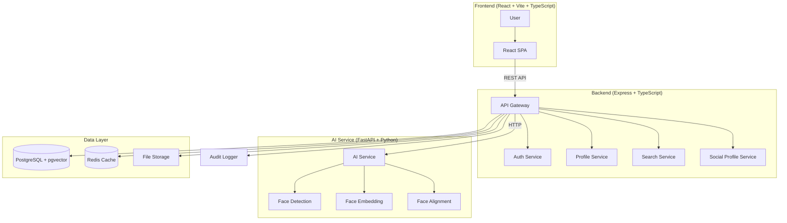
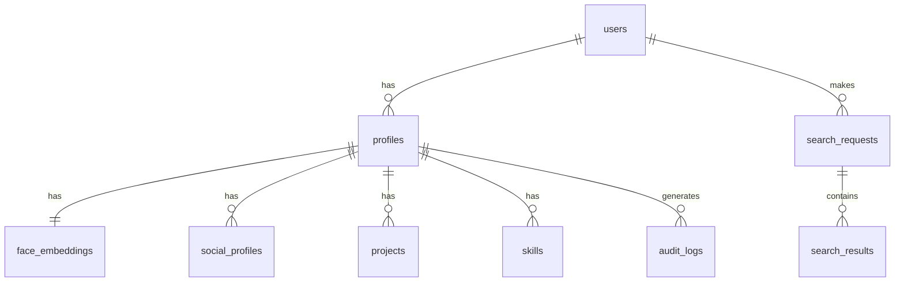
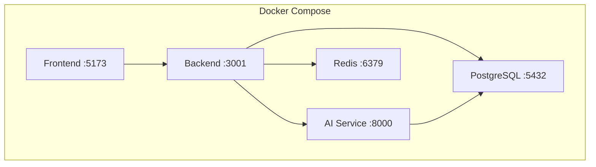
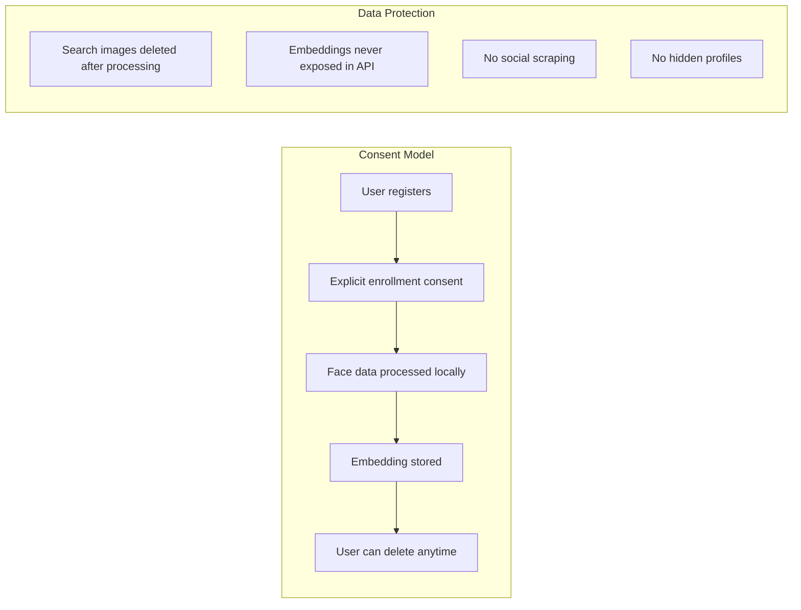

# Face Identity Platform — Project Architecture

## 1. System Overview

A consent-based face identity and public-profile discovery platform. Users voluntarily enroll with a profile and face embedding. Anyone can then search by uploading a photo to find possible matches **only within enrolled profiles**. The system never identifies random strangers or scrapes external data.



## 2. Frontend Architecture

**Stack:** React 18 + Vite + TypeScript + Tailwind CSS

```
frontend/src/
├── components/        # Reusable UI components
│   ├── ui/            # Base components (Button, Input, Card, Modal)
│   ├── layout/        # Layout components (Header, Sidebar, Footer)
│   ├── face/          # Face-specific (BoundingBox, UploadZone, CameraCapture)
│   └── profile/       # Profile components (ProfileCard, SocialLinks)
├── pages/             # Route pages
├── hooks/             # Custom React hooks
├── services/          # API client functions
├── stores/            # State management (Zustand)
├── types/             # TypeScript type definitions
├── utils/             # Helper functions
└── App.tsx            # Root component
```

**Key Patterns:**
- API calls via `fetch` with typed responses
- Zustand for global state (auth, profile, search)
- React Router v6 for navigation
- Tailwind CSS for styling (no CSS-in-JS)
- React Hook Form for form validation

## 3. Backend Architecture

**Stack:** Node.js 20 + Express + TypeScript

```
backend/src/
├── controllers/       # Request handlers
├── routes/            # Route definitions + middleware
├── services/          # Business logic layer
├── middleware/         # Auth, validation, rate-limit, upload
├── models/            # Database models (Drizzle ORM)
├── validators/        # Zod schemas for input validation
├── utils/             # Logger, helpers, constants
└── config/            # Environment config
```

**Design Principles:**
- Controller → Service → Repository pattern
- All inputs validated via Zod
- JWT-based authentication
- Role-based access (admin, user)
- Structured JSON logging
- Centralized error handling middleware

## 4. AI Service Architecture

**Stack:** Python 3.11 + FastAPI + OpenCV + InsightFace

```
ai-service/
├── app/
│   ├── api/           # FastAPI route handlers
│   ├── models/        # ML model wrappers
│   ├── services/      # Detection, embedding, alignment
│   ├── schemas/       # Pydantic request/response models
│   └── utils/         # Image processing helpers
├── requirements.txt
├── Dockerfile
└── tests/
```

**Face Processing Pipeline:**

```
Input Image
    ↓
[1] Validate (MIME, size, dimensions)
    ↓
[2] Decode (OpenCV imread)
    ↓
[3] Face Detection (InsightFace / RetinaFace)
    ↓  → No face? Return error
[4] Face Alignment (landmark-based affine transform)
    ↓
[5] Face Embedding (InsightFace / ArcFace → 512-d vector)
    ↓
[6] Normalize embedding (L2 normalization)
    ↓
Return: embedding vector + bounding box + confidence
```

**Model Selection:**
- **InsightFace (buffalo_l):** BSD-3 license, includes detection + recognition
- Fallback: `face_recognition` library (MIT license, dlib-based)
- Both run fully locally, no network calls

## 5. Database Architecture

**Stack:** PostgreSQL 15 + pgvector extension



- **pgvector** for HNSW approximate nearest-neighbor search
- Vector dimension: 512 (InsightFace ArcFace)
- Similarity metric: cosine distance
- Index type: HNSW with `lists=100, ef_construction=64`

## 6. Authentication Architecture

**Stack:** Custom JWT (no external dependency for core MVP)

- Access token: 1-hour expiry, signed with HS256
- Refresh token: 30-day expiry, httpOnly cookie
- Password hashing: bcrypt (cost 12)
- No OAuth required for MVP (can be added later)

**Flow:**
```
Register → hash password → store user → return tokens
Login    → verify password → generate tokens → set cookie
Refresh  → validate refresh token → issue new access token
Logout   → clear cookie → blacklist token
```

## 7. Storage Architecture

**Local Dev:** `./uploads/` directory
**Production:** Supabase Storage (free tier) or local filesystem

```
uploads/
├── profiles/{user_id}/
│   └── face.jpg        # Profile face image
└── searches/{search_id}/
    └── query.jpg       # Temporary search image (deleted after processing)
```

- Images validated on upload (MIME, size, dimensions)
- Search images deleted after embedding generation (privacy)
- Profile images retained while profile exists

## 8. Vector Search Architecture

```
Query embedding (512-d)
    ↓
pgvector HNSW index scan (cosine distance)
    ↓
Top-K candidates (K=10)
    ↓
Confidence scoring:
  - similarity > 0.70 → High
  - similarity 0.50–0.70 → Medium
  - similarity 0.35–0.50 → Low
  - similarity < 0.35 → No confident match
    ↓
Filter: only return candidates above minimum threshold (0.35)
    ↓
Rank by similarity descending
    ↓
Return top results with confidence labels
```

**Threshold Configuration (env vars):**
```
MATCH_THRESHOLD_HIGH=0.70
MATCH_THRESHOLD_MEDIUM=0.50
MATCH_THRESHOLD_LOW=0.35
SEARCH_TOP_K=10
```

## 9. API Communication

```
Frontend ←→ Backend API (Express, port 3001)
              ↓
Backend ←→ AI Service (FastAPI, port 8000)
Backend ←→ PostgreSQL (port 5432)
Backend ←→ Redis (port 6379)
Backend ←→ File Storage (local / Supabase)
```

- Frontend and Backend communicate via REST (JSON)
- Backend and AI Service communicate via HTTP (internal network)
- All inter-service communication within Docker network
- No external API calls required for core functionality

## 10. Deployment Architecture



**Container Strategy:**
- Frontend: Node 20 (dev) or Nginx (production)
- Backend: Node 20 Alpine
- AI Service: Python 3.11 Slim (with OpenCV/InsightFace)
- PostgreSQL 15 with pgvector pre-installed
- Redis 7 Alpine

## 11. Security Architecture

```
[Client] → HTTPS → [Nginx/Caddy]
                      ↓
              [Rate Limiter]
                      ↓
              [CORS Middleware]
                      ↓
              [JWT Auth Middleware]
                      ↓
              [Input Validation (Zod)]
                      ↓
              [Controller]
                      ↓
              [Service]
                      ↓
              [Repository / DB]
```

**Key Security Controls:**
- Rate limiting: 100 req/min general, 10 req/min for auth
- CORS: whitelist frontend origin only
- Helmet headers for XSS/CSRF
- SQL injection prevented via parameterized queries (Drizzle ORM)
- File upload validation (MIME, magic bytes, size)
- No raw embedding exposure in API responses
- Audit logging for all face operations

## 12. Privacy Architecture



**Privacy Principles:**
1. **Consent-first:** No enrollment without explicit consent
2. **Data minimization:** Store only embedding (512 floats), not raw biometric
3. **Transparency:** Clear explanation of what data is stored
4. **User control:** Delete profile, embedding, social links anytime
5. **No surprise identification:** Results labeled as "possible match," not proof
6. **Temporary processing:** Search images deleted after embedding extraction
7. **No external collection:** Never scrape social media or external databases

## 13. Error Handling

**Backend Error Response Format:**
```json
{
  "error": {
    "code": "FACE_NOT_DETECTED",
    "message": "No face was detected in the uploaded image",
    "details": "The image may be too dark, blurry, or not contain a visible face"
  }
}
```

**Error Categories:**
| Category | Examples | HTTP Status |
|----------|----------|-------------|
| Validation | Invalid input, missing fields | 400 |
| Auth | Invalid credentials, expired token | 401 |
| Forbidden | Insufficient permissions | 403 |
| Not Found | Resource doesn't exist | 404 |
| Conflict | Duplicate email, already enrolled | 409 |
| AI Error | No face detected, embedding failed | 422 |
| Rate Limit | Too many requests | 429 |
| Server | Internal error | 500 |

## 14. Scalability Considerations

| Component | Bottleneck | Solution |
|-----------|-----------|----------|
| Vector search | Large enrolled database | HNSW index, partitioning |
| AI inference | High request volume | GPU workers, model optimization |
| File storage | Disk space | Tiered storage, cleanup policies |
| Database | Connection pool exhaustion | PgBouncer, connection pooling |
| Frontend | Bundle size | Code splitting, lazy loading |

## 15. Local Development Architecture

```bash
# Start all services
docker-compose up -d

# Or run individually:
cd frontend && npm run dev      # Port 5173
cd backend && npm run dev       # Port 3001
cd ai-service && uvicorn main:app --port 8000
# PostgreSQL: 5432, Redis: 6379
```

**Development Requirements:**
- Docker Desktop or Docker Engine
- Node.js 20+
- Python 3.11+
- PostgreSQL 15+ with pgvector
- Redis 7+
- 4GB+ RAM (InsightFace model loading)
